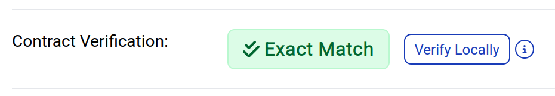
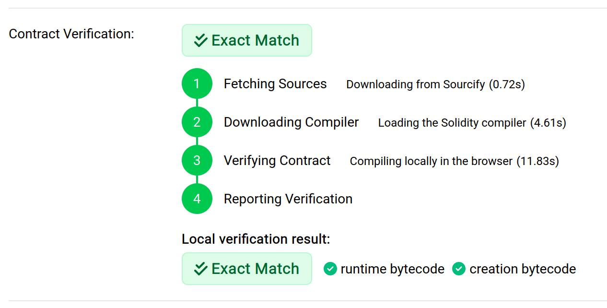

# Local contract verification

To get greater assurance that the smart contract code and interface belonging to an address truly matches its on-chain bytecode, you can verify a smart contract directly in your browser using data from your own node.

In the Contract tab of a verified smart contract, click the "Verify Locally" button to begin:

Once it finishes, check the badge at the bottom to see the result:

**Note:** The Solidity compiler is downloaded from `binaries.soliditylang.org` when you run a local verification. You can change the source, or disable this feature entirely, by setting the [`sourcify.localContractVerification` config options](../config/options/external-data-sources.md#solidity-compiler-downloads).
