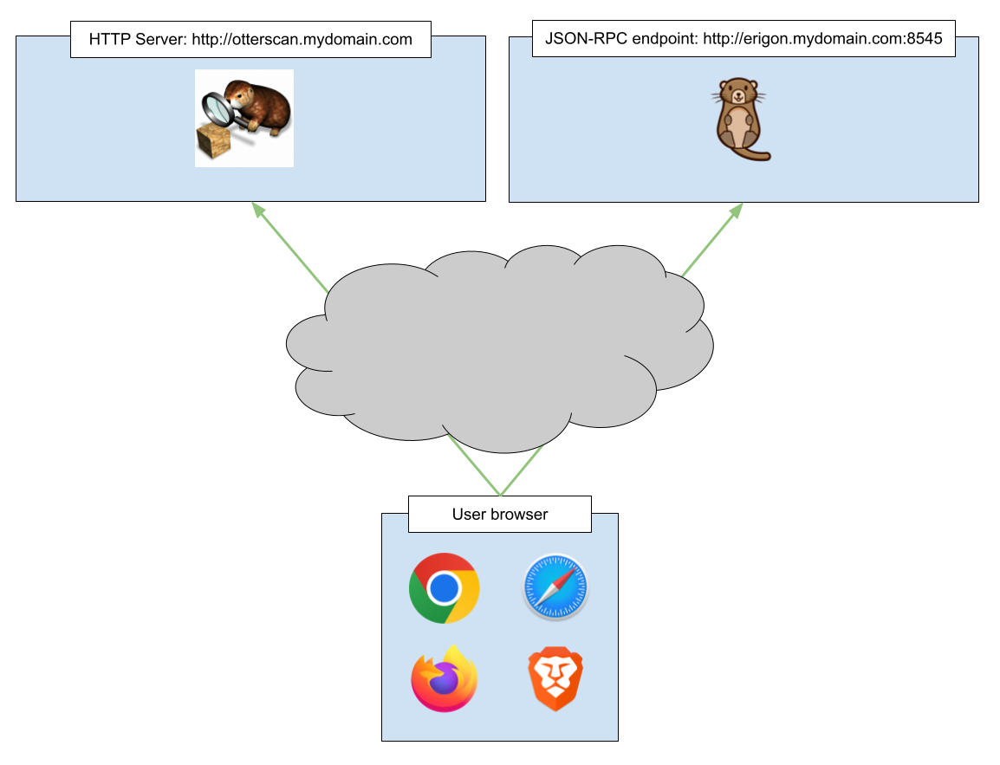

# Architecture overview

You can run all components that make Otterscan possible in your own machine, but it is likely you are going to run it in your local network.

For a better understanding, let's assume every component is in a different machine. First of all, you need to make sure all endpoints are accessible from the browser you are going to use.

The following sections will explain in more details the required configuration for each of these components.
