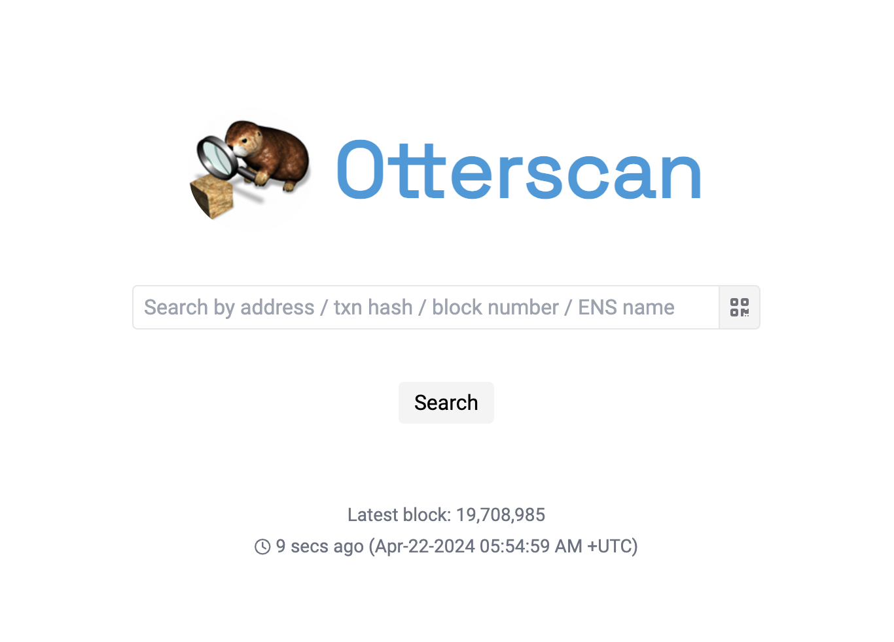
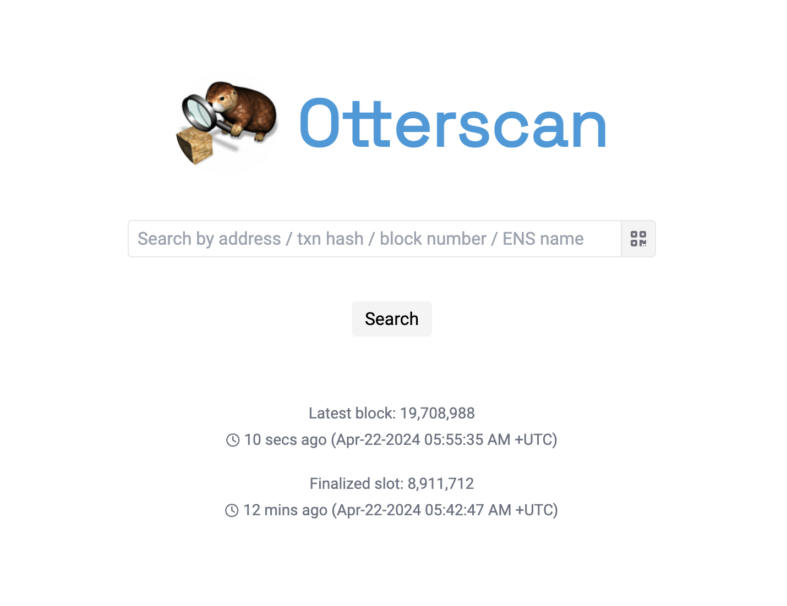

# Validating the installation

You can make sure everything is working correctly if the homepage is able to show the latest block/timestamp your Erigon node is at just below the search button.

If the beacon chain support is properly configured, you should see the latest finalized slot as well.

